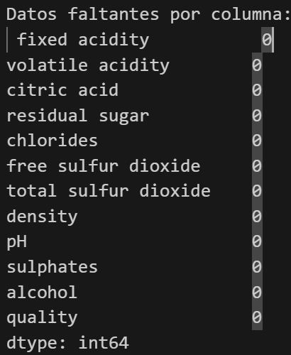
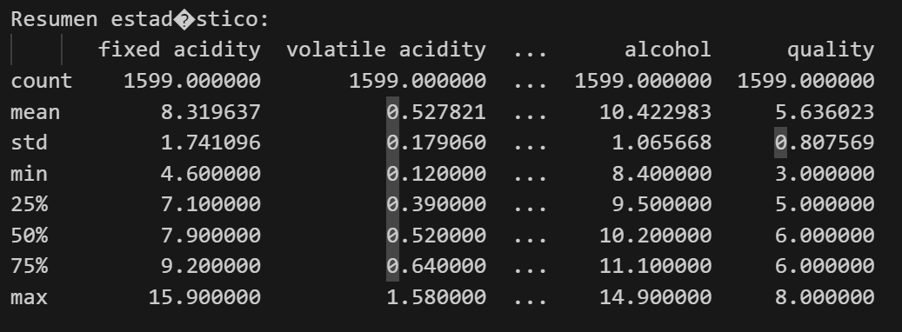
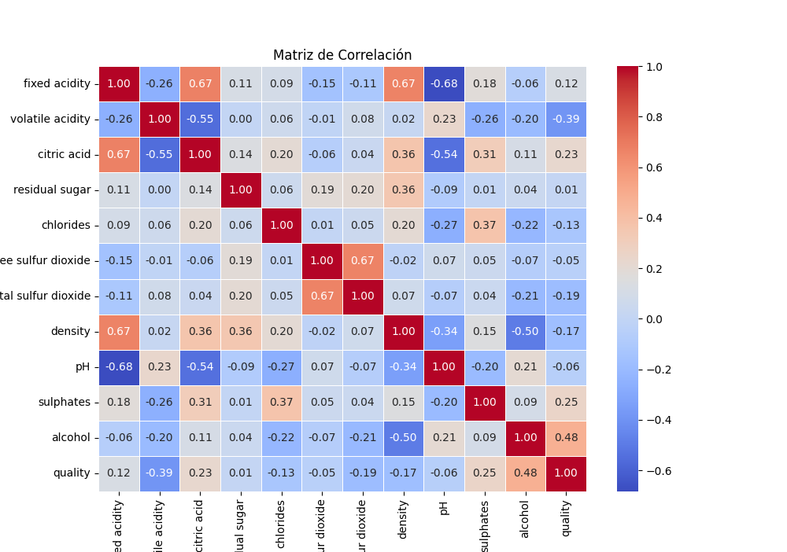
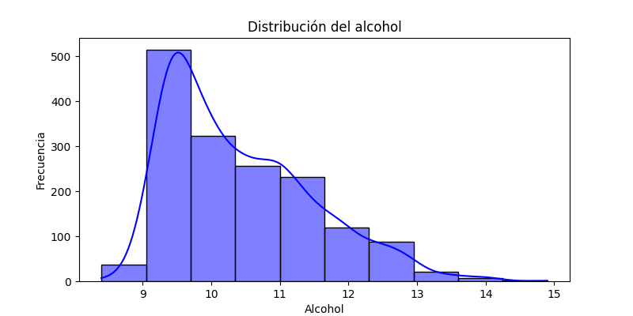
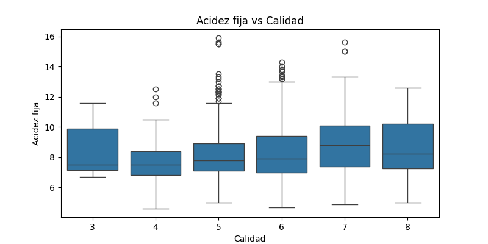
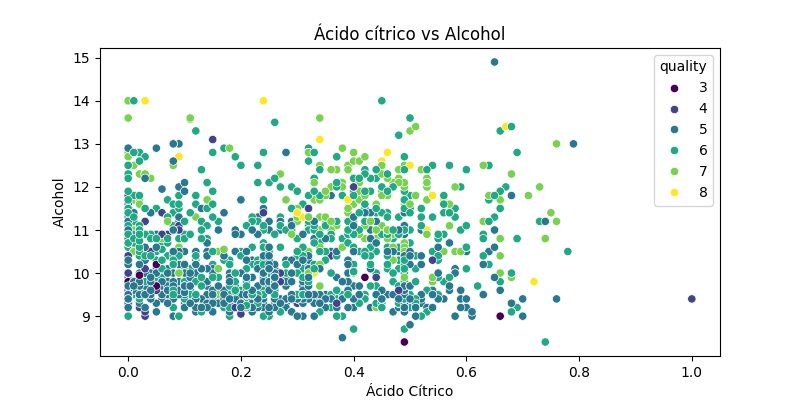

# SOG21S25_201901374
# Tarea #3

## 1. Limpieza de los datos

## 2. Resumen estadistico

## 3. Matriz de correlación

## 4. Graficos

### Histograma del alcohol

### Boxplot de la acidez fija según la calidad

### Relación entre ácido cítrico y alcohol

## Conclusiones
1.  El nivel de alcohol varía bastante, y podría estar relacionado con la calidad del vino.
2. La acidez fija muestra diferencias según la calidad, indicando que puede ser un factor relevante en la clasificación del vino.
3. Existe una correlación interesante entre el ácido cítrico y el alcohol, lo que podría influir en el sabor del vino.
